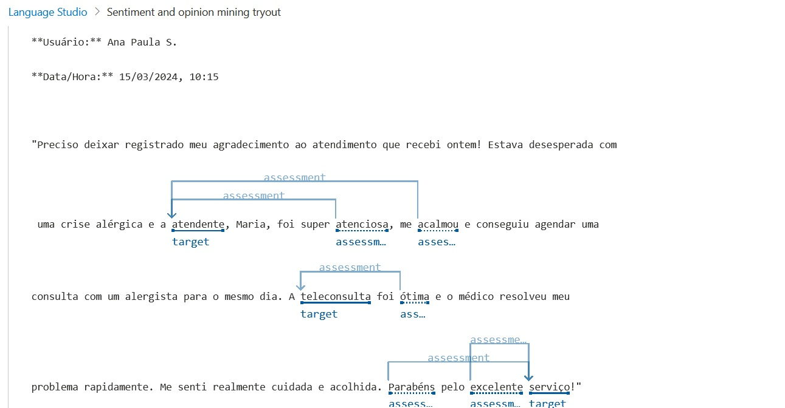

# dioLanguageStudio

# dioLanguageStudio

## Análise de Sentimentos com Language Studio do Microsoft Azure

### Passo a passo para usar o Language Studio

1. **Acesse o Language Studio**: Faça login na sua conta do Microsoft Azure e acesse o [Language Studio](https://language.azure.com/).
2. **Crie um Projeto de Análise de Sentimentos**: Na página inicial do Language Studio, selecione a opção para criar um novo projeto e escolha "Análise de Sentimentos".
3. **Carregue os Comentários**: Na pasta `inputs` deste repositório, você encontrará o arquivo com os comentários feitos por usuários dos serviços de um plano de saúde. Carregue este arquivo no projeto.
4. **Execute a Análise**: Inicie a análise de sentimentos e aguarde a conclusão.

### Resultado da Análise

A imagem abaixo mostra a saída obtida através da análise dos comentários:

